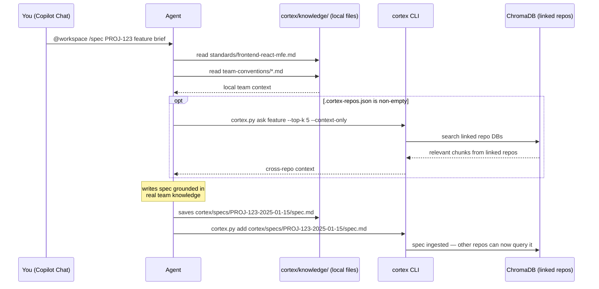
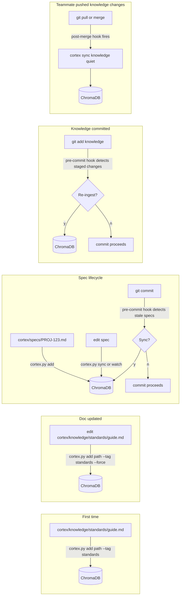

# cortex

A local knowledge base for spec-driven development with AI agents.

cortex stores your team's standards, architecture decisions, design system docs, and feature specs as plain markdown files — and indexes them into a local vector database for cross-repo federation.

**Agents read your own knowledge files directly. The DB is only queried when linked repos are involved.**

**No API keys. No cloud. Runs entirely on your machine.**

---

## How It Works

**cortex is a data pipeline and federation layer.**
**Copilot Chat is the interface.** Agents use cortex for context, then do the work.

### Context retrieval — two modes

**Current repo (no linked repos):** Agents read your `cortex/knowledge/` markdown files directly — no DB query needed. You committed those files; the agent picks the 1–2 most relevant ones for the task.

**With linked repos:** Agents read local files first, then also query the DB to pull in matching knowledge from linked repos (design system, shared platform, etc.).



### What the DB is for

The DB serves two purposes:
1. **Publish your knowledge** — ingest your files so linked repos can query them
2. **Consume linked knowledge** — query other repos' DBs when they have relevant context

You never query your own DB for your own knowledge. You just read the files.

---

## Installation

### 1. Copy cortex into your repo

```bash
cp -r path/to/cortex-workflow/{cortex.py,cortex,requirements.txt,AGENTS.md,.github,.vscode} path/to/your-repo/
```

This copies the full cortex toolkit — CLI, Python package, agents, commands, and the pre-built knowledge files — into your repo root. Your repo will look like:

```
your-repo/
├── cortex.py
├── cortex/
│   ├── agents/
│   ├── commands/
│   ├── cortex/          ← Python package
│   ├── knowledge/
│   └── specs/
├── requirements.txt
├── AGENTS.md
├── .github/
└── .vscode/
```

### 2. Create the virtual environment

Do this **once per project**. The venv lives in `cortex/.venv/` and persists on disk — you don't need to recreate it when you reopen VS Code, just reactivate it.

**macOS / WSL:**
```bash
cd cortex
python3 -m venv .venv
source .venv/bin/activate
cd ..
```

**Windows PowerShell:**
```bash
cd cortex
python3 -m venv .venv
.venv\Scripts\Activate.ps1
cd ..
```

> Each repo you copy cortex into gets its own `cortex/.venv/`. To resume work in a later session, just run the activate command again — no reinstall needed. Next time you open VS Code, you only need to reactivate the venv — unless you're using the VS Code tasks, which activate it automatically.

### 3. Install dependencies

```bash
pip install -r requirements.txt
```

Uses scikit-learn for local embeddings — no model download, no external requests.

### 4. Verify

```bash
python3 cortex.py --help
```

### 5. Add to .gitignore

```
cortex/.venv/
__pycache__/
.context.md
.env
.cortex-repos-local.json
```

`.cortex-repos-local.json` is machine-specific — it records local filesystem paths for linked repos (used by `cortex repos sync`). It is written automatically when you run `repos add <path>` and should not be committed.

### 6. Install git hooks

```bash
python3 cortex.py install-hook
```

Installs a pre-commit hook (prompts to sync stale specs and knowledge before commit) and a post-merge hook (silently re-ingests knowledge after `git pull`). Neither ever blocks a commit.

> Hooks live in `.git/hooks/` which is not committed. Every teammate must run this once after cloning.

---

## Starting a Session

`cortex.py` auto-detects and relaunches with the venv Python — you **don't need to activate the venv** to run cortex commands. Just open your terminal and run:

```bash
python3 cortex.py watch          # auto-sync specs on save (recommended — leave running)
python3 cortex.py watch --knowledge  # also watch cortex/knowledge/ files
```

Or use `Cmd+Shift+P` → `Tasks: Run Task` → `cortex: watch specs` to run it in a VS Code terminal panel.

> **Venv activation is only needed** if you're running `pip install` or other Python commands directly (not through `cortex.py`). To activate: `source cortex/.venv/bin/activate` (macOS/WSL) or `cortex\.venv\Scripts\Activate.ps1` (Windows).

---

## Initial Ingest

Create the folder structure in one command:

```bash
python3 cortex.py init
```

This creates `cortex/knowledge/`, `cortex/specs/`, and `.github/prompts/` with stub README files, then prints the next steps. Or create manually:

```bash
mkdir -p cortex/knowledge/{standards,design-system,adrs,vision,skills,patterns,team-conventions}
mkdir -p cortex/specs
```

| Your existing docs | Folder | Tag |
|-------------------|--------|-----|
| Coding standards, style guides | `cortex/knowledge/standards/` | `standards` |
| Design system docs | `cortex/knowledge/design-system/` | `design-system` |
| Architecture decisions, RFCs | `cortex/knowledge/adrs/` | `adr` |
| Platform vision, principles | `cortex/knowledge/vision/` | `vision` |
| How-to guides, runbooks | `cortex/knowledge/skills/` | `skills` |
| Implementation patterns | `cortex/knowledge/patterns/` | `patterns` |
| Team norms, PR process | `cortex/knowledge/team-conventions/` | `team-conventions` |

```bash
python3 cortex.py add ./cortex/knowledge/standards        --tag standards
python3 cortex.py add ./cortex/knowledge/design-system    --tag design-system
python3 cortex.py add ./cortex/knowledge/adrs             --tag adr
python3 cortex.py add ./cortex/knowledge/vision           --tag vision
python3 cortex.py add ./cortex/knowledge/skills           --tag skills
python3 cortex.py add ./cortex/knowledge/patterns         --tag patterns
python3 cortex.py add ./cortex/knowledge/team-conventions --tag team-conventions
```

Check it worked:

```bash
python3 cortex.py stats                               # chunks by tag
python3 cortex.py audit                               # flag empty or sparse tags
python3 cortex.py ask "design system button component"
```

### Ingestion scenarios



---

## Slash Commands (Copilot Chat)

All agent work happens in Copilot Chat using these commands.
Full instructions for each command are in `cortex/commands/`.

### Workflow

The four core steps — run these in order for every feature.

| Command | What you give it | What you get |
|---------|-----------------|-------------|
| `/vision` | A business brief (any format) | Mission, personas, capabilities, and product plan in `cortex/knowledge/vision/` — ingested immediately |
| `/spec` | Ticket + requirement (any length) | Completed spec seeded with real team context |
| `/build` | A spec file | Ordered implementation tasks with effort and AC refs |
| `/review` | A spec file or code path | READY/NEEDS WORK/BLOCKED verdict with specific issues |

### Tools

Supporting commands — use as needed at any stage.

| Command | What you give it | What you get |
|---------|-----------------|-------------|
| `/plan` | An epic or business goal | Feature breakdown + ready-to-run `/spec` commands |
| `/ops` | A spec file, deploy description, or runbook topic | Infra review (before dev), deployment checklist, or runbook — grounded in platform knowledge |
| `/refactor` | A file or folder | P1/P2/P3 refactor plan with citations to team standards and ADRs |
| `/doc` | A topic or decision | New knowledge entry or ADR, ingested immediately |
| `/wiki` | A topic or existing knowledge file | Deep, structured reference entry — Overview, How It Works, Examples, Common Mistakes |
| `/ask` | Any question | Answer grounded in the knowledge base |
| `/standup` | Nothing | Current spec status across all tickets |
| `/learn` | Topic + section after completing a task | Corrections from this session captured as reusable rules in `cortex/knowledge/team-conventions/` |
| `/merge` | A learnings file + target knowledge doc | High-confidence corrections baked natively into the authoritative doc, re-ingested |

### Usage

```
@workspace /plan "users need to manage notification preferences across all channels"

@workspace /spec PROJ-1234 "notification preferences UI"

@workspace /spec PROJ-1234
I need to build a notification preference centre. The current system was built
before the design system existed and uses native HTML, direct DOM manipulation,
and three conflicting state approaches across MFEs. We need to:
- Replace all native inputs with DS components
- Unify state through the localStorage bridge
- Ensure WCAG 2.1 AA compliance
- Support email, push, and in-app notification types
The design should follow the settings page pattern established in PROJ-1100.

@workspace /review #file:cortex/specs/PROJ-1234-2025-01-15/spec.md

@workspace /review src/app/notifications/ --security

@workspace /build #file:cortex/specs/PROJ-1234-2025-01-15/spec.md

@workspace /doc "we chose the event bus pattern for cross-MFE notification state" --adr

@workspace /wiki "how the team handles cross-MFE notification state"

@workspace /refactor #file:src/app/notifications/ "prepare for design system migration"

@workspace /ops #file:cortex/specs/PROJ-1234-2025-01-15-notification-preferences.md

@workspace /ops deploy "notification preferences v2 release"

@workspace /ops runbook "rolling back a failed notification service deploy"

@workspace /ask "how does the team handle form validation errors"
```

### Scenarios

**Starting a new project**

```
# 1. Dump the product brief into Copilot Chat
@workspace /vision
We're building an internal developer portal. Engineers need to discover services,
read runbooks, and raise support requests without leaving the IDE. The platform
must support SSO and integrate with PagerDuty and Backstage.

# cortex generates cortex/knowledge/vision/{mission,personas,capabilities,product-plan}.md
# and ingests them immediately — all future agents have product context

# 2. Decompose into features
@workspace /plan "engineers need a service catalogue with search and ownership info"
```

---

**Taking a feature from idea to implementation**

```
# Write the spec
@workspace /spec PROJ-456 "service catalogue search"

# Review it — agents must pass this gate before build
@workspace /review #file:cortex/specs/PROJ-456-2025-03-07/spec.md

# Returns: READY ✓ — agent lists any standards gaps or missing AC

# Generate implementation tasks
@workspace /build #file:cortex/specs/PROJ-456-2025-03-07/spec.md

# After coding — review the actual implementation
@workspace /review src/app/catalogue/ --security
```

---

**Capturing a decision or new pattern**

```
# Record an ADR after a significant choice
@workspace /doc "we chose Backstage as the service catalogue backend over a custom solution" --adr

# Document a pattern that emerged during the feature
@workspace /doc "lazy-loaded search with debounce — pattern discovered in PROJ-456"

# Both are ingested immediately and available to all future agents
```

---

**Onboarding a new teammate**

```
# They get full team context in one command
@workspace /ask "give me an orientation — what are we building, how is it structured, and what are the non-negotiables?"

# Dive into specifics
@workspace /ask "how do we handle authentication across MFEs?"
@workspace /ask "what design system components exist for data tables?"
```

---

### Getting context into Copilot Chat manually

For any Copilot session where you want DB context without a slash command:

```bash
python3 cortex.py ask "your topic" --context-only | pbcopy    # macOS
python3 cortex.py ask "your topic" --context-only | clip      # WSL/Windows
python3 cortex.py ask "your topic" --context-only > .context.md
```

Then in Copilot Chat: `#file:.context.md  [your question]`

---

## Workflow

The full feature lifecycle:

```
0. /vision   →  onboard project with business intelligence (mission, personas, capabilities, product plan)
1. /plan     →  decompose epic, get spec candidate commands
2. /spec     →  create spec (title or long requirement — both work)
3. /review   →  check spec is complete and standards-aligned
4. /ops      →  infra review before dev starts — catch platform implications early
5. /build    →  implementation tasks (only after READY verdict)
6. [code]
7. /review   →  code review against team standards
8. /refactor →  standards audit on existing code if needed
9. /doc      →  capture new patterns or ADRs quickly
10. /wiki    →  write deep reference docs for anything worth long-form documentation
11. /ops     →  deployment checklist before release, runbooks for ops processes
12. /learn   →  capture any agent corrections from this task as reusable rules
13. /merge   →  quarterly: promote High-confidence corrections into the authoritative docs
```

Never skip `/review` before `/build`. A spec that hasn't been reviewed shouldn't be built.

---

## Cross-repo Queries

This is the primary use case for the DB. Link other repos so `cortex ask` searches across multiple project knowledge bases — for example, pulling design system standards into your app's agent context without duplicating the docs.

**These commands are run manually, once per repo, by whoever sets up the project:**

```bash
python3 cortex.py repos add design-system         # link by name
python3 cortex.py repos add ../shared-platform    # or by local path (also records path for sync)
python3 cortex.py repos add api-gateway --tags standards,adr  # optional tag filter
python3 cortex.py repos ls                        # see links + DB status
python3 cortex.py repos rm design-system          # unlink
python3 cortex.py repos sync                      # re-ingest knowledge from all linked repos
```

Links are stored in `.cortex-repos.json` at the repo root — committed, so the whole team inherits them automatically on clone. Repos are referenced by **name** (git root folder name), not path, so the config works unchanged on every machine.

**Keeping linked knowledge fresh:** When a linked repo updates its knowledge and you want to pull those changes into your local DB, run `cortex repos sync`. It re-runs `sync --knowledge` in each linked repo's directory, updating their local DBs. Only works for repos you added by local path — the path is recorded automatically in `.cortex-repos-local.json` (machine-local, gitignored).

```json
{
  "linked": [
    {"name": "design-system"},
    {"name": "api-gateway", "tags": ["standards", "adr"]}
  ]
}
```

When you run `cortex ask`, it queries the current project's DB plus all linked DBs, merges results by relevance score, and returns the best top-k across all of them. Each result is labelled with its source project.

```
cortex ask · "button component"  (current-project + design-system + api-gateway)

0.94  cortex/knowledge/design-system/buttons.md  [design-system]
0.89  cortex/knowledge/standards/components.md   [current-project]
0.81  cortex/knowledge/adrs/api-decisions.md     [api-gateway]
```

If a linked repo hasn't been ingested on the current machine, it's skipped with a warning — it never blocks the query.

**Typical setup per repo:**

| Repo | Links to |
|------|----------|
| frontend-app | design-system, shared-standards |
| mobile-app | design-system, shared-standards |
| backend-api | shared-standards |
| design-system | _(no links — it's the source)_ |

---

## Keeping Specs in Sync

Spec files are the source of truth. After editing a spec, sync the DB:

```bash
python3 cortex.py sync                  # detect and sync changed specs
python3 cortex.py watch                 # auto-sync specs on every save
python3 cortex.py watch --knowledge     # also watch cortex/knowledge/ files (run in a terminal panel)
```

After editing knowledge docs manually:

```bash
python3 cortex.py sync --knowledge      # detect and sync changed knowledge files
```

### Git hooks

```bash
python3 cortex.py install-hook
```

Installs two hooks. Neither ever blocks a commit.

> **Note:** Hooks live in `.git/hooks/`, which is not committed to the repo. Every teammate must run `python3 cortex.py install-hook` themselves after cloning.

**pre-commit** — runs two checks before every commit:

- **Stale specs** — if any spec file has changed since it was last ingested, you're asked whether to sync it to the DB before the commit lands.
- **Staged knowledge files** — if any files under `cortex/knowledge/` are staged, you're asked whether to re-ingest them so the DB reflects what's being committed.

```
cortex: Stale specs detected:
  → cortex/specs/PROJ-123-feature.md

Sync specs to DB before commit? [y/N]: y
✓ 1 spec(s) synced and staged.

cortex: Knowledge files staged — DB may be out of date:
  → cortex/knowledge/standards/
  → cortex/knowledge/vision/

Re-ingest knowledge to keep DB in sync? [y/N]: y
✓ Knowledge re-ingested and staged.
```

**post-merge** — after every `git pull` or `git merge`, silently re-ingests any knowledge files that changed. Teammates' knowledge updates land in your local DB automatically.

```
# After git pull — no action needed, hook runs automatically:
# python3 cortex.py sync --knowledge --quiet
```

---

## VS Code Tasks

All cortex operations are available as VS Code tasks:
`Cmd+Shift+P` → `Tasks: Run Task` → select from the `cortex:` list.

Includes: ask (with clipboard options), sync, watch, ls, stats, add path, ingest all knowledge, generate artifacts, install hook.

---

## Refreshing Knowledge Artifacts

Standards, vision, and ADR artifacts are generated on demand from the DB.

```bash
python3 cortex.py generate standards    # → cortex/knowledge/standards/STANDARDS.md
python3 cortex.py generate vision       # → cortex/knowledge/vision/VISION.md
python3 cortex.py generate adr          # → cortex/knowledge/adrs/ADR-INDEX.md
python3 cortex.py generate all --yes    # all three, no confirmation prompts
```

Commit the updated files so teammates and agents always have current content.

Tune what gets included: edit `STANDARDS_TOPICS`, `VISION_TOPICS`, `ADR_TOPICS` in `cortex/cortex/generate.py`.

---

## Onboarding a New Teammate

1. Clone the repo
2. Follow [Installation](#installation) steps 1–5 (venv, deps, gitignore)
3. Run bootstrap — ingests knowledge, syncs linked repos, installs hooks in one command:
   ```bash
   python3 cortex.py bootstrap
   ```
4. If any linked repos were skipped (no local path registered), clone them and register:
   ```bash
   python3 cortex.py repos add ../design-system
   python3 cortex.py repos sync
   ```
5. In Copilot Chat: `@workspace /ask "give me an orientation to this codebase and how the team works"`

---

## CLI Reference

```bash
# Setup
python3 cortex.py init                            # create folder structure (new repo)
python3 cortex.py bootstrap                       # ingest knowledge + sync linked repos + install hooks (after cloning)
python3 cortex.py install-hook                    # install pre-commit + post-merge hooks
python3 cortex.py uninstall-hook

# Ingest
python3 cortex.py add <path> --tag <tag>          # ingest a file or folder
python3 cortex.py add <path> --tag <tag> --force  # force re-ingest

# Query (searches local DB + all linked repos)
python3 cortex.py ask "query"                     # interactive results
python3 cortex.py ask "query" --tag <tag>         # filtered
python3 cortex.py ask "query" --context-only      # pipe-friendly

# Cross-repo links
python3 cortex.py repos add <name-or-path>        # link a repo by name or local path
python3 cortex.py repos add <name> --tags a,b     # link with tag filter
python3 cortex.py repos rm <name>                 # unlink
python3 cortex.py repos ls                        # list links + DB availability
python3 cortex.py repos sync                      # re-ingest knowledge from all linked repos

# Sync and watch
python3 cortex.py sync                            # sync stale specs
python3 cortex.py sync --knowledge                # sync stale cortex/knowledge/ files
python3 cortex.py watch                           # auto-sync specs on save
python3 cortex.py watch --knowledge               # also watch cortex/knowledge/ files

# DB inspection
python3 cortex.py audit                           # tag coverage — flag empty/sparse
python3 cortex.py stats                           # chunks by tag
python3 cortex.py ls                              # all indexed documents
python3 cortex.py ls --specs                      # spec files + sync status
python3 cortex.py rm <source>                     # remove a source from DB

# Artifacts
python3 cortex.py generate standards              # → cortex/knowledge/standards/STANDARDS.md
python3 cortex.py generate vision                 # → cortex/knowledge/vision/VISION.md
python3 cortex.py generate adr                    # → cortex/knowledge/adrs/ADR-INDEX.md
python3 cortex.py generate all --yes
```

---

## Extending cortex

Any team can add their own slash commands without touching the core codebase.

### Add a team-specific command

Create two files in your repo:

**1. `cortex/commands/tools/{name}.md`** — the command definition (what to do, how, output format):

```markdown
# /deploy-checklist

Our team's pre-deployment checklist for the payments service.

## Steps
1. Pull deployment context: `python3 cortex.py ask "payments deployment" --context-only --tag skills`
2. ...
```

**2. `.github/prompts/tools/{name}.prompt.md`** — the Copilot Chat entry point:

```markdown
---
mode: agent
description: Generate a payments service deployment checklist
---

Read and follow the instructions in `cortex/commands/tools/deploy-checklist.md` exactly.
Always pull platform context from the knowledge base before generating output.
```

Commit both files. Every teammate inherits the command on clone. It shows up in Copilot Chat as `@workspace /deploy-checklist`.

### Examples of team extensions

| Team | Command | What it does |
|------|---------|-------------|
| Platform | `/terraform-plan` | Review a spec for Terraform implications |
| Data | `/data-contract` | Generate a data contract from a spec |
| Security | `/threat-model` | Run a threat model against a spec or feature area |
| Mobile | `/release-notes` | Draft release notes from closed specs |

The `cortex/commands/tools/` folder is the extension point for team-specific commands. The core cortex workflow commands live in `cortex/commands/` — yours work exactly the same way.

---

## Design Principles

**Knowledge lives in git, not the tool.**
Everything in `cortex/knowledge/` is plain markdown — grep-able, diff-able, PR-reviewable, and readable by humans without cortex running. Agents read these files directly for current-repo context. The ChromaDB is a federation layer, not the source of truth: you publish your knowledge by ingesting it so other linked repos can query it. If the embedding approach ever changes, the knowledge survives — re-ingest and done.

**No external dependencies.**
No API keys, no cloud, no running services. cortex works on a laptop with no internet after the first model download. If budget disappears, the tool keeps running.

**Teams own their workflow.**
The command files in `cortex/commands/` define how agents behave. Teams can add, modify, or override any command by editing these files. Nothing is locked in a platform.

---

## Troubleshooting

**`ModuleNotFoundError`** — venv not active. (Since cortex.py auto-relaunches with the venv, this usually means the venv hasn't been created yet.)
```bash
cd cortex && python3 -m venv .venv && source .venv/bin/activate && cd ..
pip install -r requirements.txt
```

**`No DB found`** — nothing ingested yet.
```bash
python3 cortex.py add ./cortex/knowledge/standards --tag standards
```

**Weak search results (scores below 0.35)** — knowledge base needs more content on that topic. Add docs to the relevant `cortex/knowledge/` subfolder and re-ingest. Scores 0.35–0.55 are usable; above 0.55 is a strong match.

**Copilot slash commands not working** — ensure you're in Agent mode (`@workspace` prefix). Prompts live in `.github/prompts/`.

**WSL: `pbcopy` not found** — use `clip` instead.

**Spec watch not detecting changes** — some editors write atomically. Try `--interval 0.5` or run `python3 cortex.py sync` manually.
